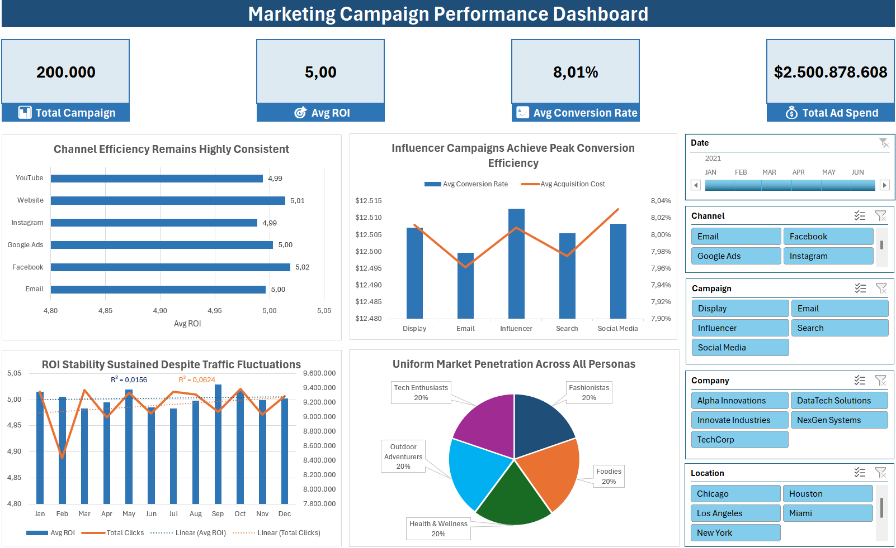

# 📊 Marketing Campaign Performance Analysis

Analisis performa **200.000 marketing campaign** untuk mengevaluasi efektivitas channel pemasaran, efisiensi biaya akuisisi, dan responsivitas customer segment menggunakan **Microsoft Excel Dashboard**.

Project ini bertujuan membantu tim marketing **mengalokasikan budget campaign secara lebih efektif berdasarkan data performa historis**.

---

# 🧠 Executive Summary

Perusahaan perlu memahami **channel mana yang benar-benar menghasilkan ROI tertinggi** serta **campaign strategy mana yang paling efisien dalam menghasilkan konversi**.

Melalui analisis dataset berisi **200.000 campaign dari 5 perusahaan teknologi**, berdasarkan project ini saya mengidentifikasi pola performa campaign berdasarkan:

* Channel pemasaran
* Campaign type
* Customer segment
* Lokasi geografis
* Tren waktu

Dashboard interaktif memungkinkan stakeholder untuk **mengeksplorasi performa campaign secara real-time** dan menemukan peluang optimasi dalam strategi marketing.

---

# 📊 Key Metrics

| Metric             | Value       |
| ------------------ | ----------- |
| Total Campaigns    | 200,000     |
| Companies Analyzed | 5           |
| Locations          | 5 Cities    |
| Campaign Channels  | 6           |
| Campaign Types     | 5           |
| Analysis Period    | 2021 – 2022 |

---

# 🎯 Business Questions

1️⃣ Channel pemasaran mana yang menghasilkan **ROI tertinggi**?

2️⃣ Campaign type mana yang **paling efisien dari sisi biaya vs conversion**?

3️⃣ Bagaimana **tren ROI campaign berubah dari waktu ke waktu**?

4️⃣ Customer segment mana yang **paling responsif terhadap campaign marketing**?

5️⃣ Apakah terdapat **perbedaan performa campaign antar lokasi geografis**?

---

# 🗂 Dataset Overview

Dataset berisi **200.000 campaign marketing** dengan total **16 kolom** yang mencakup informasi campaign performance, audience segmentation, dan engagement metrics.

| Column             | Description                                                       |
| ------------------ | ----------------------------------------------------------------- |
| `Campaign_ID`      | ID unik campaign                                                  |
| `Company`          | Perusahaan penyelenggara campaign                                 |
| `Campaign_Type`    | Jenis campaign (Email, Social Media, Display, Search, Influencer) |
| `Target_Audience`  | Segmentasi target audience                                        |
| `Duration`         | Durasi campaign                                                   |
| `Channel_Used`     | Channel pemasaran                                                 |
| `Conversion_Rate`  | Rasio konversi campaign                                           |
| `Acquisition_Cost` | Biaya akuisisi campaign                                           |
| `ROI`              | Return on Investment                                              |
| `Location`         | Kota target campaign                                              |
| `Clicks`           | Jumlah klik                                                       |
| `Impressions`      | Jumlah tayangan                                                   |
| `Engagement_Score` | Skor engagement                                                   |
| `Customer_Segment` | Segmentasi pelanggan                                              |
| `Language`         | Bahasa campaign                                                   |
| `Date`             | Tanggal campaign                                                  |

Dataset tersedia pada file:

```
data/marketing_campaign_dataset.csv
```

---

# ⚙ Technical Workflow

### 1️⃣ Data Cleaning

Langkah pembersihan data:

* Menghapus simbol `$` dan `,` pada kolom currency
* Konversi tipe data numerik
* Validasi format conversion rate
* Menghapus duplikat campaign
* Verifikasi missing values

---

### 2️⃣ Data Transformation

Menambahkan beberapa kolom analisis untuk mempermudah eksplorasi data:

* `Cost_Category` → pengelompokan biaya campaign

---

### 3️⃣ Exploratory Data Analysis

Analisis menggunakan **Pivot Tables** untuk mengevaluasi:

* ROI berdasarkan channel pemasaran
* Conversion rate vs acquisition cost
* Tren performa campaign per bulan
* Distribusi campaign berdasarkan customer segment

---

### 4️⃣ Dashboard Development

Dashboard interaktif dibangun menggunakan:

* Pivot Charts
* KPI Cards
* Slicer interaktif
* Timeline filter

---

# 🔎 Key Insights

### 1️⃣ Channel Performance

Beberapa channel menunjukkan performa ROI yang secara konsisten lebih tinggi dibanding channel lainnya.

**Insight:**
Channel dengan ROI tertinggi menunjukkan potensi besar untuk **menjadi fokus utama dalam strategi marketing budget allocation**.

---

### 2️⃣ Campaign Cost Efficiency

Beberapa tipe campaign mampu menghasilkan **conversion rate tinggi dengan acquisition cost yang relatif rendah**.

**Insight:**
Campaign type tersebut merupakan strategi yang **paling cost-efficient untuk meningkatkan volume konversi**.

---

### 3️⃣ Temporal Trends

Analisis tren bulanan menunjukkan adanya **fluktuasi performa ROI sepanjang tahun**.

**Insight:**
Pola ini dapat dimanfaatkan untuk **perencanaan campaign pada periode dengan performa historis terbaik**.

---

### 4️⃣ Customer Segment Responsiveness

Segment pelanggan tertentu menunjukkan **engagement dan conversion rate lebih tinggi dibanding segment lainnya**.

**Insight:**
Segment ini memiliki potensi tinggi untuk **strategi marketing yang lebih personalisasi**.

---

# 💡 Business Recommendations

| Priority  | Recommendation                                                    | Impact                                    |
| --------- | ----------------------------------------------------------------- | ----------------------------------------- |
| 🔴 High   | Alokasikan lebih banyak budget pada channel dengan ROI tertinggi  | Meningkatkan efisiensi spending marketing |
| 🔴 High   | Fokus pada campaign type dengan cost-per-conversion terendah      | Memaksimalkan volume konversi             |
| 🟡 Medium | Targetkan campaign pada customer segment dengan engagement tinggi | Meningkatkan conversion probability       |
| 🟡 Medium | Optimalkan campaign pada periode dengan ROI historis terbaik      | Memaksimalkan return campaign             |

---

# 📊 Dashboard

Dashboard dirancang untuk memberikan **visualisasi performa campaign secara komprehensif**.



Dashboard menampilkan:

* KPI utama campaign performance
* perbandingan ROI antar channel
* analisis conversion rate vs acquisition cost
* tren ROI bulanan
* distribusi campaign berdasarkan customer segment

Dashboard juga dilengkapi **Slicer dan Timeline filter** untuk eksplorasi data interaktif.

---

# 📂 Repository Structure

```
amazon-sales-analysis/
│
├── README.md
│
├── data/
│   └── marketing_campaign_dataset.csv
│
├── excel/
│   └── marketing_campaign_dataset.xlsx
│
├── deck/
│   └── marketing_campaign_deck.pptx
│
└── assets/
    └── dashboard_overview.png
```

---

# 🛠 Tools & Skills

### Tools

* Microsoft Excel 2024
* GitHub

### Data Analysis Techniques

* Data Cleaning
* Exploratory Data Analysis
* Pivot Tables
* Dashboard Design

### Business & Analytical Skills

* Marketing Performance Analysis
* ROI Analysis
* Customer Segmentation Analysis
* Data-Driven Decision Making

---

# ⚠️ Limitations

Beberapa keterbatasan dalam analisis ini:

* Dataset bersifat **synthetic**, sehingga pola data tidak sepenuhnya mencerminkan kondisi industri nyata
* Tidak tersedia data **customer-level behavior** sehingga analisis retention atau lifetime value tidak dapat dilakukan
* Tidak tersedia data budget campaign detail untuk analisis cost allocation yang lebih mendalam
